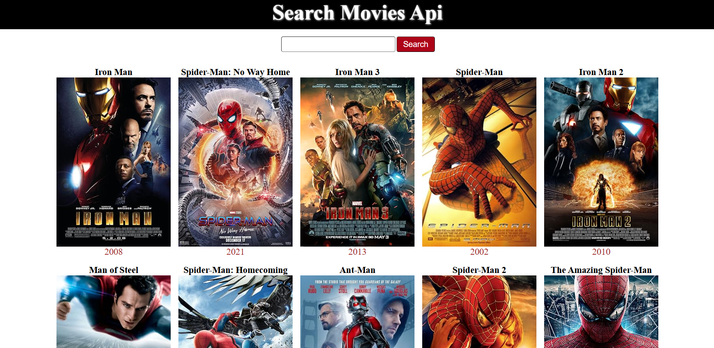
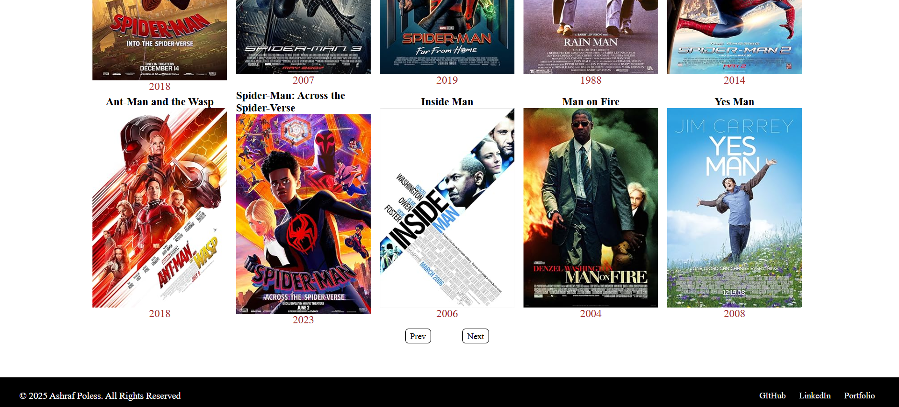

## MOVIE SEARCH API

### Project Overview

This project integrates the OMDB API to fetch and display movie data such as titles, year, Image, and more. The goal is to create a web application that allows users to search for movies, view detailed information, and explore related films.

### Project Aspects

- Movie Search: Users can search for movies by title.

- Movie Details: Fetch and display movie details such as ratings, plot, actors, and release year.

- API Integration: Fetches real-time movie data from the OMDB API.

- Error Handling: Handles API errors, invalid responses, and user input validation.

### Roles in the Project

- Frontend Developer: Implements the UI and handles API requests.

- UI/UX Designer: Ensures an intuitive and visually appealing interface.

### Tech Stack

- Frontend: React.js (Vite)

- API: OMDB API

## Roadmap

#### Phase 1: Project Setup & API Integration

- Set up React.js project using Vite.

- Integrate OMDB API for movie search and details.

#### Phase 2: UI Design & Implementation

- Create a clean and responsive UI using Tailwind CSS.

- Implement search functionality.

#### Phase 3: Advanced Features
- Implement pagination for search results.

- Improve error handling and loading states.

- Phase 4: Optimization & Deployment

- Optimize performance.

- Deploy the application on Vercel .

### NPM Libraries Used

- react: Core library for UI development.

- react-router-dom: For navigation and routing.

- axios: For handling API requests.

## Connect With Me

- [PORTFOLIO](ashrafpoless.vercel.app)
- [GITHUB](https://github.com/Ashrafpoless)
- [LINKEDIN](https://www.linkedin.com/in/ashraf-poless-034349317/)